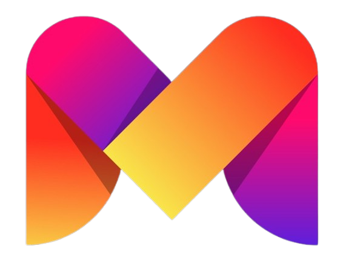

# 🚀 Manglesh Nimbalkar | Personal Portfolio

<div align="center">
  
  <br />
  <h3>✨ Where Creativity Meets Technology ✨</h3>
  
  [](https://manglesh-nimbalkar.netlify.app/)
  [](https://nextjs.org/)
  [](https://www.typescriptlang.org/)
  [](https://tailwindcss.com/)
</div>

## 📋 Overview

Welcome to my personal portfolio repository! This website showcases my journey as a developer, featuring my skills, projects, and professional achievements. Built with modern web technologies, it represents both my technical abilities and design sensibilities.

## ✨ Live Website

**[https://manglesh-nimbalkar.netlify.app/](https://manglesh-nimbalkar.netlify.app/)**

## 🛠️ Tech Stack

<table>
  <tr>
    <td align="center"><br />Next.js</td>
    <td align="center"><br />TypeScript</td>
    <td align="center"><br />Tailwind CSS</td>
    <td align="center"><br />React</td>
  </tr>
</table>

## ✨ Features

- **📱 Fully Responsive Design** - Perfect viewing experience across all devices
- **🎨 Modern UI/UX** - Clean, intuitive interface with smooth animations
- **📂 Project Showcase** - Detailed portfolio of my work with live demos
- **🧩 Skills Display** - Visual representation of my technical competencies
- **🏆 Achievements Section** - Highlighting my professional accomplishments
- **📬 Contact Information** - Easy ways to reach out and connect

## 📸 Screenshots

<div align="center">
  <i>View the live site to see the portfolio in action!</i>
</div>

## 🚀 Getting Started

### Prerequisites

- Node.js (v16 or higher)
- npm or yarn

### Installation & Setup

```bash
# Clone this repository
git clone <your-repo-url>

# Navigate to the project
cd portfolio

# Install dependencies
npm install
# or
yarn install

# Start the development server
npm run dev
# or
yarn dev
```

Then open [http://localhost:3000](http://localhost:3000) in your browser to see the site.

## 📁 Project Structure

```
/public       # Static assets and images
/src
  /app        # Next.js app directory and page components
  /components # Reusable UI components
```

## 📞 Let's Connect

I'm always open to interesting conversations and opportunities. Feel free to reach out!

<div>
  <a href="https://www.linkedin.com/in/yourusername" target="_blank">
    
  </a>
  <a href="mailto:your.email@example.com">
    
  </a>
</div>

## 📝 License

All rights reserved. This project and its contents are my intellectual property.

---

<div align="center">
  <p>⭐ Star this repo if you found it interesting!</p>
  <p>Designed & Developed with ❤️ by Manglesh Nimbalkar</p>
</div>
